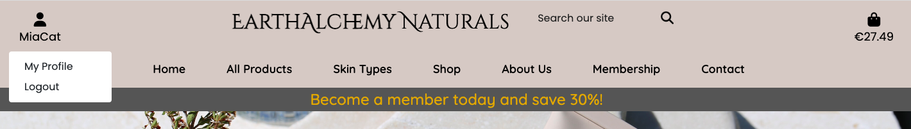
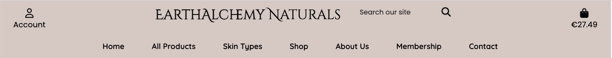
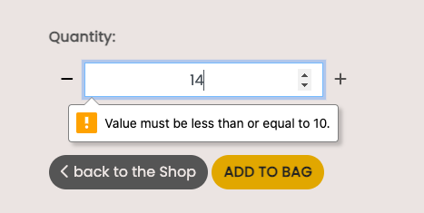
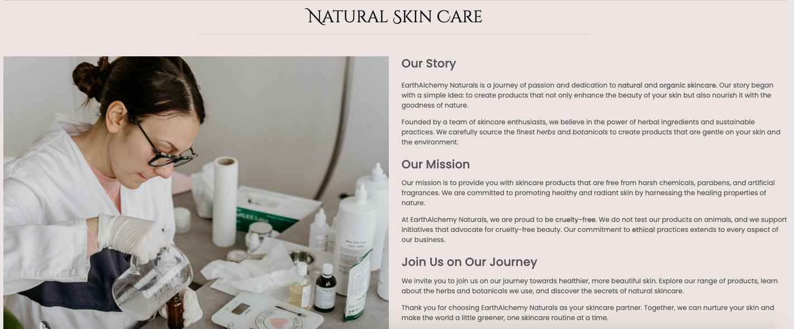
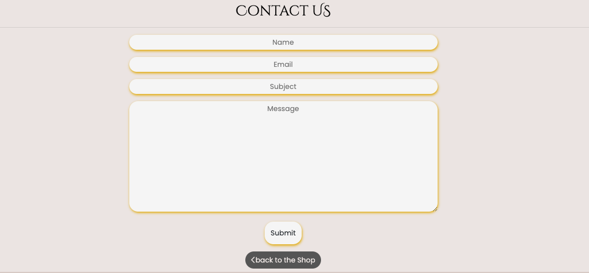
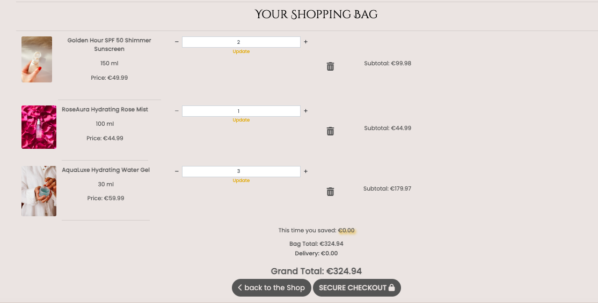
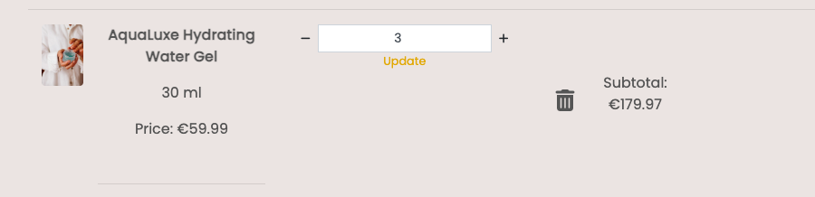

# EarthAlchemy Naturals

EarthAlchemy Naturals is a B2C e-commerce application specializing in natural and holistic products. The site is designed to offer users a visually appealing and user-friendly online shopping experience. Its core features include product offerings, discounts, a newsletter, social media presence, and a user-friendly profile function for saving customer information.

One standout feature of EarthAlchemy Naturals is the membership option. Customers can purchase a 12-month membership, which unlocks exclusive benefits, including a remarkable 30% discount on every product in the catalog. Additionally, members have the opportunity to customize their packaging box and receive luxurious packaging for a truly premium experience.

The site operates as a virtual retail store, allowing users to browse, search, and filter a wide range of natural products. Customers can select items to add to their shopping cart and make secure payments through a seamless checkout process.

For general users, the platform provides comprehensive product details, along with information about the main (star) ingrediant of each products. Customers can also subscribe to the company's newsletter to stay updated. Registered users can save their profile details, to make their future purchases faster and also have the availability to buy the membership. 

Admin users hold the ability to oversee and manage the product catalog and herb profiles. Their responsibilities encompass tasks such as adding new products, adjusting pricing, explaining the main herb used for each products, and constantly updating these information.

The project involves a variety of web marketing strategies, including organic social media marketing through Facebook, and email marketing via a newsletter subscription managed through Mailchimp. 
The structure and purpose of EarthAlchemy Naturals take inspiration from the Code Institute's Boutique Ado example application, ensuring a solid foundation for this e-commerce venture.

This full-stack project was built using the Django framework, Python, HTML, Bootstrap, and CSS. Additionally, ElephantSQL and AWS were used to store data, images, and static files. Stripe was used for payment processing.

[Link to the live project](https://earthalchemy-naturals-99139eee523b.herokuapp.com/)

# Contents

- [User Experience (UX)](https://github.com/Lilla-Kavecsanszki/EarthAlchemyNaturals#user-experience-ux)
  - [Ideal client](https://github.com/Lilla-Kavecsanszki/EarthAlchemyNaturals#ideal-client)
  - [User stories & Epics](https://github.com/Lilla-Kavecsanszki/EarthAlchemyNaturals#user-stories-and-epics)
- [Planning](https://github.com/Lilla-Kavecsanszki/EarthAlchemyNaturals#planning)
- [Design](https://github.com/Lilla-Kavecsanszki/EarthAlchemyNaturals#design)
  - [Wireframes](https://github.com/Lilla-Kavecsanszki/EarthAlchemyNaturals#wireframes)
  - [Entity Relationship Diagrams](https://github.com/Lilla-Kavecsanszki/EarthAlchemyNaturals#entity-relationship-diagrams)
  - [Theme](https://github.com/Lilla-Kavecsanszki/EarthAlchemyNaturals#theme)
  - [Typography](https://github.com/Lilla-Kavecsanszki/EarthAlchemyNaturals#typography)
- [Languages Used](https://github.com/Lilla-Kavecsanszki/EarthAlchemyNaturals#languages-used)
- [Frameworks, Libraries, Programs & Technologies Used](https://github.com/Lilla-Kavecsanszki/EarthAlchemyNaturals#frameworks-libraries-programs--technologies-used)
- [Features](https://github.com/Lilla-Kavecsanszki/EarthAlchemyNaturals#features)
- [User Story - Features Cross-Reference table](https://github.com/Lilla-Kavecsanszki/EarthAlchemyNaturals#user-story---features-cross-reference-table)
- [Deployment](https://github.com/Lilla-Kavecsanszki/EarthAlchemyNaturals#deployment)
- [Testing](https://github.com/Lilla-Kavecsanszki/EarthAlchemyNaturals#testing)
  - [Manual Testing](https://github.com/Lilla-Kavecsanszki/EarthAlchemyNaturals#manual-testing)
  - [Further Testing](https://github.com/Lilla-Kavecsanszki/EarthAlchemyNaturals#further-testing)
  - [Bugs](https://github.com/Lilla-Kavecsanszki/EarthAlchemyNaturals#bugs)
- [Credits](https://github.com/Lilla-Kavecsanszki/EarthAlchemyNaturals#credits)
  - [Media and Content](https://github.com/Lilla-Kavecsanszki/EarthAlchemyNaturals#media-and-content)
  - [Acknowledgments and Code](https://github.com/Lilla-Kavecsanszki/EarthAlchemyNaturals#acknowledgments-and-code)
  - [Disclaimer](https://github.com/Lilla-Kavecsanszki/EarthAlchemyNaturals#disclaimer)

# User Experience (UX)

### Ideal client

The ideal client for this business is:

-	English speaking
-	Health and Wellness Enthusiasts
-	Value Quality and Customization
-	Eco-Conscious Consumers
-   Regular Online Shoppers
-   Avid Shoppers of Natural Products

Visitors to the EarthAlchemy Naturals website are seeking:

- A user-friendly and informative online store that provides reliable and comprehensive information about natural and holistic products, offering insights into their benefits and uses.
- Features that foster a sense of community and engagement. Members not only enjoy substantial discounts applied to all products, promoting a shared sense of value and savings within the community but also have the opportunity to select a VIP box in their choice of two beautiful colors as a complimentary add-on.
- The option to access a wide array of natural and holistic products, supporting a holistic lifestyle and promoting eco-conscious consumer choices.
- A variety of product categories to choose from, including toners, serums, sun protection and more, catering to diverse individual preferences and needs.
- A flexible shopping experience, allowing users to adjust their orders and quantities as needed, ensuring a convenient and personalized shopping journey.

This website is the best way to help them achieve these goals because:

- The user-friendly menu makes accessing different functionalities very easy and intuitive.
- The website's content is carefully curated and regularly updated to provide reliable and up-to-date information to the visitors.
- The membership program offers substantial discounts on all products and the added benefit of a VIP box in two color choices. This not only provides cost savings but also an element of personalization, creating a sense of value for members.
- EarthAlchemy Naturals offers a wide variety of natural and holistic products across different categories, catering to individual preferences and needs. Visitors can find an array of items that resonate with their lifestyle and goals.
- The website ensures a flexible and personalized shopping experience. Visitors can adjust their orders and quantities as needed, reflecting a commitment to customer convenience.
- The website also ensures a seamless and secure payment process, while registered users can save their profile details making this process even faster or the next time. 

In summary, the EarthAlchemy Naturals website effectively supports visitors in achieving their goals by offering information, community engagement, discounts, personalization through the VIP box, a diverse product range, and a user-friendly shopping experience. This combination of features and offerings aligns with the needs and interests of individuals seeking natural cosmetic products while creating a supportive and engaged community.

[Back to top](https://github.com/Lilla-Kavecsanszki/EarthAlchemyNaturals#contents)

### User stories and Epics

#### Epic 1: User Management

- US0101: User Registration: As a new user, I can register an account with my email and password so that I can view my profile.
- US0102: User Authentication: As a returning user, I can log in using my existing credentials or log out so that I can access my personal information in a secure way.
- US0103: Receive Email Confirmation After Registration: As a new user, I can receive an email confirmation after registering so that I can verify that my account registration was successful.
- US0104: Personal User Profile: As a site user, I can access my personalized user profile so that I can view my order history and payment information and keep track of purchases

#### Epic 2: Product Management

- US0201: Purpose of website and navigation: As a site user I can quickly identify what the website is selling and easily navigate the pages so that I can quickly find the information and functionality I am looking for

- US0202: Product Creation: As an admin, I can add new products to the website so that I can keep my shop up to date.
- US203: Product Update: As an admin, I can edit product information so that all products have the most relevant and useful information.
- US0204: Product Deletion: As an admin, I can remove products that are no longer available so that I can keep my shop up to date.
- US0205: Product View: As a shopper, I can view a list of products so that I can browse and discover the collection.
- US0206: Product Details: As a shopper, I can view detailed information about each product so that I can make the best decision for my purchase.
- US0207: View main herb: As a site user I can view bio details of the main herb of the product was made of so that I can easily learn more about it.
- US0208: Product Search: As a shopper, I can search for products by keywords or categories so that I can target and speed up my purchase time.
- US0209: Product Filtering: As a shopper, I can filter products based on various criteria (e.g., price, ingredients, skin type) so that I can find the best selection of products specifically for me.
- US0210: Sort Products: As a shopper, I can sort specific category of products so that I can find the cheapest, most purchased, most expensive products easier.
- US0211: Handle 404 and 500 errors: As a site user I can return to Home after http 404 or 500 response so that I feel I am still working within the website and can navigate easily

#### Epic 3: Shopping Cart and Checkout

- US0301: Add to Cart: As a shopper, I can add products to my shopping cart so that I can purchase 1 or multiple items at the same time.
- US0302: Cart Management: As a shopper, I can update the quantity or remove items from my cart so that I can make changes later on in the process and/ or rectify any mistakes.
- US0303: View shopping cart total: As a shopper, I can view the total of my cart at any time so that I can avoid over-spending.
- US0304: Secure Payment Process: As a shopper, I can enter my card details with an intuitive checkout process so that I proceed with a secure and payment and purchase.
- US0305: Checkout Summary: As a, I can view a checkout page so that see details of my order and my delivery and payment details.
- US0306: Order Confirmation: As a shopper I can view an order confirmation so that I see the relevant details after completing my purchase.
- US0307: Email Confirmation: As a shopper, I can receive an email confirmation so that I have records of my purchases.
- US0308: Notifications: As a shopper, I can receive small messages from the website so that I am reassured on all actions and interactions throughout my visit.

#### Epic 4: Membership

- US0501: Understand Membership Benefits: As a shopper, I can learn about the benefits of being a member so that I can make informed decisions about joining.
- US0502: Join Membership Program: As a shopper, I can enroll in the membership program to access bonus points and exclusive offers.
- US0503: Member’s Price: As a member, I can access the member’s price for each product so that I can select that.
- US0504: VIP Access: As a member, I can see new products before they would go public so that I can purchase them first.
- US0505: Savings: As a member, I can view and track how much I have saved, paying the member price, in my user profile so that I can see the worth of my membership.
- US0506: Opt-Out of Membership: As a member, I can opt-out of the membership program if I no longer wish to participate so that I have flexibility.

#### Epic 5: Events and Blog

- US0601: Event Announcements: As an admin, I can announce upcoming events so that I can make my customers aware of new opportunities.
- US0602: Event Details: As a shopper, I can view detailed information about each event so I can decide to join.
- US0603: Educational Blog Posts: As an admin, I can publish informative blog posts about natural cosmetics so that I can spread information in the topic.
- US0604: Blog Reading: As a shopper, I can read blog posts and articles so that I can learn. more in the topic.

#### Epic 6: Admin Panel

- US0701: Admin Dashboard: As an admin, I can have a dashboard to manage products, discounts, and memberships so that I can stay organised.
- US0702: User Management: As an admin, I can manage user accounts and their activities so that I can take responsibility for my website.

#### Epic 7: SEO and Web Marketing

- US0801: Subscribe to Newsletter: As a site user, I can subscribe to the company newsletter so that I can keep up with company news and offers.
- US0802: Follow Brand Updates and Explore on Social Media: As a site user, I can find, visit and and follow the company's Facebook page so that I can stay connected with brand updates and announcements.
- US0803: SEO: As a site user, I can find the site through web searches so that I can easily access the site.
- US0804: View Privacy Policy: As a site user, I can access and view the company's privacy policy so that I can ensure the company is GDPR compliant and respects my privacy.
- US0805: Access Educational Content: As a site user, I can access blog posts and educational content about natural cosmetics and skincare so that I can learn more about the products.
- US0806: Easily Contact Customer Support: As a site user, I can find clear contact information and options for reaching out to customer support so that I can get assistance when needed.
- US0807: Share Feedback and Reviews: As a site user, I can leave reviews and feedback about products I've purchased so that I can share my experiences and help other shoppers.

[Back to top](https://github.com/Lilla-Kavecsanszki/EarthAlchemyNaturals#contents)

# Planning

The planning process began by identifying the target clientele, which involved creating a Persona Profile using Code Institute's template based on design thinking principles. This Persona Profile helps in understanding the needs, expectations, and preferences of the identified persona, and the website is designed to cater to these specific requirements.
You can see the persona profile [HERE](README_docs/design_thinking_persona_template.pdf).

Given the prevalence of mobile usage among our target users, creating a responsive website was a top priority in our design approach. To achieve this, the power of Bootstrap grids, elements, and responsive utilities combined with custom CSS was leveraged, to ensure seamless adaptability across various devices.

### Agile Methodology

In this project Github issues were used to create the User stories and groupped into Epics, Milestones in a Github Project. This served as the Agile tool. The issues' development was managed through a Kanban board. Currently, all the issues have been marked as "Done”.

For easy access, you can find the Epics, Issues/ User Stories with their Acceptance Criteria and Kanban board [HERE](https://github.com/users/Lilla-Kavecsanszki/projects/6).

[Back to top](https://github.com/Lilla-Kavecsanszki/EarthAlchemyNaturals#contents)

# Design

### Wireframes

[Desktop Wireframes](README_docs/wireframes_desktop.pdf)

[Tablet Wireframes](README_docs/wireframes_ipad.pdf)

[Mobile Wireframes](README_docs/wireframes_mobile.pdf)

### Entity Relationship Diagrams

To support the functionality of the DownwardDog app, five models have been designed and implemented to store essential information in databases.

To showcase the relationships between the models, I have divided them into two categories: one relevant to the Articles and the other to the Booking functionality.
The Likes and User tables in the ER diagrams are for conceptual representation only and do not directly correspond to the models.py file or the physical database tables. They provide a logical view of data relationships without showing all the actual database details managed by Django and the database system.

The Entity Relationship Diagrams below illustrate how the models are connected to each other for the Articles section:

- Post and Comment have a one-to-many relationship, where one post can have multiple comments, but each comment is associated with only one post.
- User and Likes have a many-to-many relationship, where multiple users can like multiple posts, and each like is linked to both a user and a post.
- User and Post have a one-to-many relationship, where one user can be associated with multiple posts, but each post is linked to only one user (the author). This feature is however limited for the admin.

Article ERD
 

The Entity Relationship Diagrams below illustrate how the models are connected to each other for the Booking section:

- Classes and Timetable have a one-to-many relationship, where one class can have multiple timetables, but each timetable is associated with only one class.
- Timetable and Booking have a one-to-many relationship, where one timetable can have multiple bookings, but each booking is linked to only one timetable.
- Booking and User have a many-to-one relationship, where one user can create many bookings.

The unique_booking constraint in the Booking model ensures that a user can create multiple bookings, but only one booking for the same class on the same date/time.

Booking ERD
 

[Back to top](https://github.com/Lilla-Kavecsanszki/EarthAlchemyNaturals#contents)

### Theme

- Whitesmoke - #f5f5f5
- Wisp Pink - #eae4e2
- Swiss Coffee - #d4c9c5
- Goldenrod - #daa520
- Matterhorn - #555
- Nero - #222
- Black - #000000

The chosen color palette for the EarthAlchemy Naturals website serves the purpose of conveying a clean, fresh, and elegant aesthetic that aligns with the brand values and the nature of the products. It combines neutral and vibrant tones to create a sense of purity and well-being, while also highlighting key elements for engagement and readability.

### Typography

- Poppins (Body Font):
  - Poppins is a modern and versatile sans-serif font that offers excellent readability. It provides a clean and organized look for body texts, making it easy for visitors to read and navigate the content.
- Quicksand (Body Font):
  - Quicksand is another modern sans-serif font known for its rounded and friendly appearance. It pairs well with Poppins and offers a slightly different feel, contributing to a visually pleasing and approachable design.
- Cinzel Decorative (Header Font):
  - Cinzel Decorative brings the alchemical vibes with its decorative and mystical style, making headers and titles stand out, adding a touch of intrigue and uniqueness to the design.

Overall, this combination provides a clear distinction between body text and headers while maintaining a cohesive and balanced visual appeal, creating the desired ambiance for the shop.

[Back to top](https://github.com/Lilla-Kavecsanszki/EarthAlchemyNaturals#contents)

# Languages Used

- HTML5
- Python
- CSS3
- Jquery

[Back to top](https://github.com/Lilla-Kavecsanszki/EarthAlchemyNaturals#contents)

# Frameworks, Libraries, Programs & Technologies Used

- [Balsamiq](https://balsamiq.com/) was used to create the Wireframes
- [Lucid](https://lucid.app/documents#/documents?folder_id=recent) was used to create the ER Diagrams
- [Canva](https://www.canva.com/) was used to photoshop the images used
- [ColorKit](https://colorkit.co/palette/F5F5F5-EAE4E2-D4C9C5-DAA520-555-222-000000/) was used to create the colour palette.
- Github was used as the repository for the projects code after being pushed from Git
- CodeAnywhere was used for version control, allowing me to commit changes and push them to GitHub directly from the CodeAnywhere terminal. It was the primary tool used for creating and editing all the code.
- [Google Fonts](https://fonts.google.com/) used for the Montserrat and Poiret One fonts
- [Font Awesome](https://fontawesome.com/) was used to add icons for aesthetic and UX purposes
- [Favicon](https://favicon.io/favicon-converter/) was used to create the favicon
- [Bootstrap](https://getbootstrap.com/) was used to build a responsive website quicker
- Microsoft Word was used to create the wireframes during the design process.
- [Django](https://www.djangoproject.com/) was used as the framework of the application
- [Gunicorn](https://gunicorn.org/) was used as the Web Server to run Django on Heroku
- [Pillow](https://pillow.readthedocs.io/en/stable/index.html) - Python Imaging Library used for image handling
- Django allauth used for account registration and authentication
- Django crispy forms used for form rendering
- [Amazon Web Services (AWS)](https://aws.amazon.com) used to store all of static files and images
- [Boto3](https://pypi.org/project/boto3/) the Amazon Web Services (AWS) Software Development Kit (SDK) for Python.
- [Stripe](https://js.stripe.com/v3/) used for secure payments
- [Heroku](https://heroku.com/) was used to deploy the application and provides an enviroment in which the code can execute

[Back to top](https://github.com/Lilla-Kavecsanszki/EarthAlchemyNaturals#contents)

# Features

## Home Page

### F01 Navigation Bar

The navigation bar provides easy access to all active pages for the user.

**Menu Options:**

- **Account button:** This button provides quick access to register or login and then view and manage the user's profile. In case the user is logged in already, they can find the logout option in this dropdown menu also, and in case the admin user is logged in, they can find an extra, 'Product Management' option. 
The user can quickly determine their login status by looking at the user icon located at the top left corner of the screen. When the user is not logged in, the user icon is displayed as an outline with the label "Account". In contrast, when the user is logged in, the user icon is solidly filled, and their username is shown underneath the icon.

- **Logo:** Essentially it indicates the name of the website, while it also serves as a button that is linked to the homepage as an instant solution for the user.

- **Search bar:** Users have the option to find their specific product, or narrow down the list of results by entering a search term, which will be used to search for matches within the products. The number of matching results is shown on screen and the results can be ordered by price, name and category.

- **Shopping bag:** Shows the total price of the items in cart, allowing the user to review and manage the costs of their selections.

- **Home:** This button serves as a quick link to the homepage, enabling users to navigate back to the main landing page at any point.
- **All Products:** This button enables users to view products sorted by either their price or category.

- **Skin Types:** This button enables users to view products narrowed down and selected by their skin types, offering a more personalised approach.

- **Shop:** This button enables users to view products narrowed down and selected based on their category, again to offer a personalised approach.

- **About Us:** This button takes the user to a page, where they can learn more about the company.
- **Membership:** This button takes the user to a page, where they can learn about the membership and can purchase it too.
- **Contact:** This button takes the user to the Contact page, where they can fill out a form and get in touch with the company.

**Special Case for Administrators**

When the signed-in user is the admin user or superuser, an additional link labeled "Admin" is displayed on the navigation bar.

- **Admin:** This link grants access to the Django Admin window, allowing the superuser to manage the website's data, such as adding new, modifying, deleting or using them.
  

### F02 Membership Banner

Beneath the navigation bar, each page features a banner that effectively captures the user's attention, piques their interest in the membership, its discounts, and potential purchases. This aligns with the main purpose of the website.

### F03 Hero Image and Overlay Text

On the Home page, just below the navigation bar and banner, you'll find a highly relevant image featuring a cream product labeled as 'Illumination Mask' on some stones, with a herb on the side and a gold accessory under it. This image aligns with the website's purpose and brand ambiance. Additionally, a text overlay is positioned on the top left side of the image, displaying "Luxury awaits." This conveys the idea of exclusive quality available on the website, encouraging users to become regular shoppers and, in turn, members.

### F04 Shop Now button

On top of the hero image, below the overlay text, there is a large, golden button, instantly leading to the goal of the website, which is to get the user to purchase products. The button therefore directs the user to the Products page, that lists all available the products.

### F05 Footer

Just like the navigation bar and banner, the footer is consistently displayed on every page. Located at the very bottom, it provides information about the company's social media presence, with a link for users to easily follow. It also includes a link to the company's Privacy Policy and a user-friendly subscription form, allowing users to sign up for the monthly newsletter. The footer ends with a disclaimer, mentioning the website's creator and providing a convenient link to the developer's LinkedIn profile. It also clarifies that the website was created solely for educational purposes.

## Products Page

### F06 List and View of the Products

The user can effortlessly navigate the assortment of available products for purchase on the website by utilizing the "All Products" option found in the navigation bar. The displayed product cards include an image of each product, along with relevant details such as name, category, skin type it's useful for and its price.

### F07 Information Button

 A gold "Information" button, in the bottom right corner, allowes quick access to the contact page for any questions that could come up while browsing through the products, offering faster solution and better user experience. The button is fixed to the screen, ensuring it remains accessible while the user scrolls up or down. Additionally, it features a jumping effect designed to capture the user's attention.

### F08 Filter and Sort

Apart from the search bar, which was explained as a feature in the (F01) Navigation Bar, there are another two useful functionality that the users can use to make their purchase experiences more efficient and straight forward.

Users have the option to filter the list of products and tailor their browsing to items of particular interest. For example, users can choose to view the products from a specific category or their their skin type by the drop-down options of Skin Types and Shop buttons on the navbar.
The chosen skin type or category filter is shown in the title of the page, underneath the membership banner.

Additionally users can sort results by price or their category by utilizing the drop-down options of the All Products button in the navbar. Also, under the product page title, there is an on-screen sort box that allows for sorting by price, product name and category.

The number of results is shown on the screen, next to the sort box too.

Cleansers & Exfoliators category sorted by price from low to high:

## Product Detail Page

### F09 View Product Details

When the user clicks on a product image, they can access the Product Detail page. This page will display the product's image, name, category, recommended skin type, primary or key (star) ingredient, price, description, volume (in milliliters), and an input field where they can specify the quantity they wish to purchase and add it to their shopping bag.

### F10 Star Ingredient

The star ingredient is displayed for each product on the detail page below the recommended skin type. A pulsing golden star captures the shopper's attention, and the herb's name, which is both clickable and bold in a golden color, redirects the user to the herb page. There, they can find valuable and reliable information about the ingredient they may be considering for use.

### F11 Quantity Input

The quantity input is also displayed for each product on the detail page, located just above the 'Add to Bag' button. Shoppers can use this input field to specify the quantity of each product they wish to buy.

The input field also validates the user's input, ensuring that the number is not less than 1 or greater than 10. By using the '+' and '-' buttons, the user is unable to increment beyond this range. If a user attempts to override the numbers by directly typing a larger or smaller value into the input field, a notification will be displayed when they try to proceed and add the items to their shopping bag.

### F12 Add to Bag Buttons

Below the quantity input, there are two buttons. On the left-hand side, users can return to the shop or product list, while on the right-hand side, they can proceed to add the product to their cart.

## Herb Page

### F13 View Herb Details

When the user clicks on the star ingredient's name, they can access the Herbs page. This page will display the herb's name, along with valuable information on its medical or remedial uses and specific benefits, allowing users to learn more.

### F14 Herb Image

The notable addition to this page is the large image on the right-hand side, which displays the herb in its natural form, allowing users to visualize it.

### F16 Back to the Shop

At the bottom of the page, you'll find a 'Keep Shopping' button, which provides a seamless way for the user to navigate back to the shop and enhances the overall shopping experience on the site.
 

## About Us Page

### F17 The Company

On the 'About Us' page, users can learn about the company, its values, and their story. The page explains their mission and concludes with an inviting paragraph, encouraging users to join their community. Additionally, a prominent photo on the page shows a woman in a lab coat preparing a serum in a laboratory setting, conveying the company's commitment to a serious approach in creating their products.

## Membership Page

### F18 Non-Member View

When a non-member user visits the Membership page, they'll find a descriptive overview of the membership, its price, and the option to purchase it through the 'Add to Bag' button. The description is enhanced with colorful emojis to capture the shopper's attention and maintain engagement.

Additionally, the page includes an image in the brand's signature colors and font prominently labeled 'Membership,' to effectively convey the purpose of the page to users.

As an alternative, users can easily return to the shop by clicking the 'Shop' button.

### F19 Member View

When a member user navigates to the Membership page, they will find a different view. It will show the same membership image on the left side, however the rest of the page will display the membership details of the user, and the VIP Box feature.

### F20 Membership Details

This section provides the user's membership details, customizing the title by incorporating their username, creating a personalized and engaging touch. It also displays the user's join date to the program and reminds them that their membership remains valid for 365 days. Finally, it also shows the user's current packaging choice.

### F21 VIP Box

Members also enjoy exclusive access to the VIP Box feature, allowing them to create personalized packaging for their orders. The packaging is available in two luxurious colors, matching the brand's signature pink and gold. This conveys the sense of luxury and exclusivity that comes with being a member.

Members can update their packaging choice at any time using the same dropdown menu they initially used to create their box. In both cases, they can proceed by clicking the 'Get VIP Box' button, located next to the color selection dropdown.

The updated choice is instantly visible in the membership details section of the page.

Furthermore, members have the flexibility to cancel their VIP Box and return to the default brown packaging available to all users. This can be done by clicking the 'Cancel VIP Box' button at the bottom of the page. A confirmation window will pop up, asking the user to confirm the cancellation. Once they decide to proceed, their choice will be automatically updated.

## Contact Us Page

### F22 Contact Form

The Contact page includes a contact form where users can provide their name, email address, subject, message, and then send their questions, messages, or reviews by clicking the 'Submit' button. This page offers users a convenient way to reach out to the company, whether for product inquiries, delivery-related questions, or any other reason. By including their email address in the form, users make it possible for the admin team to respond promptly.
Therefore all fields in the form are mandatory, and the site validates the correctness of the email address before allowing the user to proceed with the submission.

Finally, users can locate a 'Back to the Shop' button underneath the contact form, which directs them to the products page, further supporting the website's core objectives.

## F23 Pop-up Messages

Pop-up messages are utilized to inform users of the results of their interactions with the website. Activities such as adding items to the shopping bag, any update on the shopping cart's contents, events related to VIP boxes, submitting orders, or logging in and out etc trigger these messages, offering users immediate feedback on the event.

For example:

## Shopping Bag and Checkout

### F24 Shopping Bag and its Page

The application utilizes a 'shopping bag' where shoppers can keep track of the items they add to it. The running total of the shopping bag, which includes any applicable member's discounts, is continuously displayed beneath the shopping bag icon at the top right of the screen and is accessible from all pages.

As items are added to the shopping bag, the total is dynamically updated to reflect the cost, taking into consideration the member's discount when applicable. Users are provided with a concise summary in a small pop-up window, as well.

By clicking on the shopping bag icon, users can access the Shopping Bag Page. Here, they can view a breakdown of each item, under each other and have the flexibility to adjust each item's quanty, using the quantity input box, just as in the Product Detail page. They can also remove items entirely, by clicking on the Trash icon or typing 0 (or anything less) into the quantity input box and press Update.
For members making the purchase, the line item breakdown shows both of the original and their member's price.  

When the shopping bag is empty:

### F25 Shopping Bag Calculation

Beneath the list of line items, users are presented with a financial summary of their potential purchase. This summary includes the shopping bag total, delivery cost, and the grand total, with the member's discount factored into the calculation when applicable.

For members making a purchase, the summary also highlights the savings they've made with their current product selection. This information is visible to non-member users as well, displaying €0 (obviously) as a motivational reminder to consider membership.

### F26 Secure Checkout Buttons

On this page, users have the option to either return and continue shopping or proceed to the checkout process using the respective buttons located at the bottom of the page.

### F27 Checkout Page

When users click on the 'Secure Checkout' button, they are redirected to the checkout page. Here, they encounter a checkout form along with an order summary on the right-hand side.

The checkout form's fields feature relevant placeholders, enhancing the process's intuitiveness and user-friendliness. Fields marked with a '*' sign are mandatory, and the system will flag any omissions as part of the validation process.

If the user has a registered account and is logged in, they can check a checkbox below their details to save or update them to their profile, ensuring a more seamless experience for their next purchase.

If the user is not logged in, they have the option to do so:

Previously saved and so prepopulated:

### F28 Complete Order Button and Secure Payment

When all details are correctly filled in, the shopper can proceed with the payment by clicking the 'Complete Order' button. Alternatively, they can return to the Shopping Bag page to make adjustments using the button on the left-hand side.

Clicking the 'Complete Order' button initiates the payment process, and an overlay is applied to enhance the user experience while waiting for the payment to complete.

Payments are securely processed by Stripe widgets within the application, with webhooks ensuring proper handling in case of any issues during the payment process.

### F29 Checkout Success and Order Confirmation

After the order has been successfully submitted and the payment processed, the user is presented with the Checkout Success page and also receives an email confirmation with their order summary.

Logged in users can access their order history by visiting the My Profile page.

This can be expanded by clicking on the order number of each past order:

## Authentication

### F30 Registration, Login and Logout

Users have the option to sign up, sign in, and sign out on the site. Certain features, like the Profile or Membership is exclusively accessible to logged-in users. During the registration process, users are required to verify their email addresses to activate their accounts. After verification, the user is redirected to to the sign in page.

## Profile

### F31 My Profile Page

When a user is logged in, they have the option to save their delivery address on their profile page. The My Profile page can be accessed by clicking the user icon. If delivery details have been stored for a user, these details are automatically pre-filled on the checkout page, streamlining the checkout process. (shown previously at F27)

Profile information can be easily updated by overwriting the existing values then choosing to save the new information when submitting a new order. Alternatively, users can update their profile information directly through the My Profile page and submit the changes using the 'Update Profile Information' button.

However, the membership status field is a read-only field. Only the admin user can change its value, or it is automatically populated as 'Member' when a logged-in user purchases the Membership."

On the right-hand side of the page, users can access their Order History, as explained in F29.

## Membership

### F32 Join, purchase Membership

Some functionalities of the application are based on the role of the user, just like the membership, as well. The user needs to be registered and logged in, to be able to purchase the membership and therefore join, otherwise they will receive an error message.

When the user is logged in, they can add the membership to their shopping bag and proceed to checkout, just like any other item they want to purchase.

During the checkout process, the application recognizes the SKU number of the membership product and updates the user's profile to 'Member' status. This change activates a 30% discount on all products they wish to purchase and grants access to the member-version on the Membership page, allowing them to track their membership details and access the VIP Box feature.

The is_membership_valid function checks the validity of a membership when it is intended to be used. If the membership has expired, it resets the membership_status to 'None' in the user's profile. Consequently, the user will need to repurchase the membership to regain access to its benefits.

## Admin

### F33 Data Management

Data management is solely accessible to logged-in administrators (superusers).

### F34 Product Management

## F - Custom HTTP 404

To ensure a consistent user experience and address unexpected events in a user-friendly way, a custom page is presented for any unanticipated 404 HTTP response codes.

## Marketing

### F SEO

Keyword Research -> Google to narrow down the list, consider relevance, authoritativeness, volume and competition.
I need high enough volume, but low enough competition. URL and aria attributes. rel="noopener" in footer
Useful links for the About page - External link ideas - sources for the herb descriptions
image alts
meta data
useful, well informed and trustworthy content also helps in ranking.

Wordtracker
[Wordtracker](https://www.wordtracker.com/search?query=*%20natural%20products%20for%20skin)

Results:

- natural skin care products
- holistic skin care routine
- best online shopping sites for women
- members only discount
- premium box packaging
- natural products buy online
- exclusive discounts
- custom packaging
- online shopping with best discounts
- membership
- natural
- organic

sitemap.xml and robots.txt files have also been added to the application to help search engine crawling.

### Facebook

Another essential tool of the web marketing strategy involves leveraging social media to promote the site. A Facebook page was established for the company, and a link to it is accessible in the footer of every page also. 

[Facebook page](https://www.facebook.com/profile.php?id=61552317252926)

Screenshots from both mobile and desktop view, also the first post of the company:

### Newsletter - MailChimp

As one of the web marketing tools for the application, a newsletter subscription option was introduced. This feature is conveniently located in the footer of every page on the site. Users can simply enter their email address and click the 'Subscribe' button to join the mailing list. This was accomplished by using Mailchimp.

### F Privacy Policy and GDPR

To comply with GDPR requirements, a privacy policy was generated, using the website [Privacy Policy Generator](https://www.privacypolicygenerator.info/). Users can find the link in the footer, and by clicking on it, they can download the page.

## Future ambitions - Planned for the Next Sprint

- Prompting members to renew after membership expires

[Back to top](https://github.com/Lilla-Kavecsanszki/EarthAlchemyNaturals#contents)

# User Story - Features Cross-Reference table

How the Features align with and fulfill the User Stories by providing the necessary functionality and interactions that meet the users' needs and requirements.

[Cross-reference Table](README_docs/us_f_crossreference.pdf "crossreference_table")

[Back to top](https://github.com/Lilla-Kavecsanszki/EarthAlchemyNaturals#contents)

# Deployment

**How to Clone**

Steps
 

1. Go to the <https://github.com/Lilla-Kavecsanszki/EarthAlchemyNaturals> repository.
2. Click the Code button to the left of the green Gitpod button, then choose Local.
3. Click on headings for HTTPS, SSH, and Github CLI to find their individual URL links. Choose the HTTPs one.
4. Open your own terminal in your editor and change the current working directory to the location of where you want
   the cloned directory to be.
5. In the terminal type git clone, and then paste the URL you copied from the repository page.
6. Press enter to start the process.
7. To install the packages required by the application use the command : pip install -r requirements.txt
8. When developing and running the application locally set DEBUG=True in the settings.py file
9. Modifications performed on the local clone can be synchronized with the repository by executing the following commands:
    -  git add filenames (or "." to add all changed files)
    -  git commit -m "your message"
    -  git push
 Modifications pushed to the main branch will be implemented in the live project after re-deployment from Heroku. Ensure that you do not include DEBUG=True in the settings.py file on GitHub; this setting is intended exclusively for local use.

 

**How to Fork**

Steps
 

1. Go to the <https://github.com/Lilla-Kavecsanszki/EarthAlchemyNaturals> repository.
2. Click the fork button in the top right of the screen, between the watch, and the star buttons.

 

**Deployment of the project**

Create a respository on GitHub
 

- Use the [CI Full Template](https://github.com/Code-Institute-Org/ci-full-template) to create a project
- Click on 'Use this template' then 'Create a new respository'
- Fill out the form, especially the 'Repository name' then click on 'Create repository'
- Copy over the URL of the repository and paste it into a New Workspace on Codeanywhere then it will start to build.
- Install Django and supporting libraries in the terminal:
- Create requirements file: 'pip3 freeze --local > requirements.txt'
- Create Project: 'django-admin startproject PROJ_NAME .'
- Create App: 'python3 manage.py startapp APP_NAME'
- Create a new env.py file in the root directory and include the database:
  - 'import os' on the top in env.py file
  - Set the environment variables (same values as later in Heroku Config Vars)
  

 

ElephantSQL
 

- Create an account on [ElephantSQL](https://www.elephantsql.com/) and click "Create New Instance"
- In "Create new instance" section setup details:
    - Select the TINY TURTLE database plan and name,
    - Select region,
    - click confirm
- In the Details section you will find the URL which is necessary for the DATABASE_URL config variable later on Heroku.
  
**Connecting ElephantSQL database in Code Anywhere**

After having our instance created on Elephant SQL and the app on Heroku:

- After installing dj_database_url and psycopg2 in the terminal
- Import dj_database_url underneath the import for os in settings.py:
    import os
    import dj_database_url
- Update the DATABASES to the following code, so that the original connection to sqlite3 is commented out and we connect to the new ElephantSQL database instead. Paste in your ElephantSQL database URL.
'
    # DATABASES = {
    #     'default': {
    #         'ENGINE': 'django.db.backends.sqlite3',
    #         'NAME': os.path.join(BASE_DIR, 'db.sqlite3'),
    #     }
    # }
            
    DATABASES = {
        'default': dj_database_url.parse('database-url-here')
    }
    `

    Do not commit with this database string in the code to avoid leaving database URL in version control. It is a temporary solution so that you can connect to the new database and make migrations. This setting needs to be removed afterwards.
- In the terminal, run the showmigrations command to confirm you are connected to the external database:
  - python3 manage.py showmigrations
  - If you are, the list of all migrations should appear, but none of them should be checked off.
- Run migrations:
  - python3 manage.py makemigrations --dry-run
  - python3 manage.py makemigrations
  - python3 manage.py migrate --plan
  - python3 manage.py migrate
- Load in the fixtures if you are wokring with those. Note, that The order is very important here. Categories need to be loaded first, then products:
  - python3 manage.py loaddata categories
  - python3 manage.py loaddata products
- Create a Superuser:
  - python3 manage.py createsuperuser
- Prevent exposing the database when pushing to GitHub and delete it from settings.py.

    `
     DATABASES = {
        'default': {
            'ENGINE': 'django.db.backends.sqlite3',
            'NAME': os.path.join(BASE_DIR, 'db.sqlite3'),
        }
    }
    `

**Confirming migrations in ElephantSQL**

- On the ElephantSQL page for your database, select BROWSER (left hand side menu)
- Click the Table queries button and select auth_user.
- Click “Execute”, and you should be able to see the new created superuser details.
- This is your proof that the tables have been created and you can add data to your database.

 

Heroku

- Create a Heroku application by pressing "New" on located on the upper right side of the main page
- Select: 'Create new app' from the dropdown menu.
- Go to the next page, fill the form with the following data: 'App name' and 'Choose a region'
- Press 'Create app'
- On the Application Configuration page for the new app, click on the Resources tab.
- In the Resources tab, search for Heroku Postgre and add it to your project.
- You need to install dj_database_url and pyscopg2 in your terminal:
    - pip3 install dj_database_url
    - pip3 install psycopg2
- Click on Settings on the Application Configuration page then "Reveal Config Vars" to add credentials
- Add a new Config Var called DISABLE_COLLECTSTATIC and assign it a value of 1.
- Add a new Config Var called SECRET_KEY and assign it a value.
- The settings.py file should be updated to use the DATABASE_URL and SECRET_KEY environment variable values as follows :
  - if 'DATABASE_URL' in os.environ:
        DATABASES = {
            'default': dj_database_url.parse(os.environ.get('DATABASE_URL'))
        }
    else:
        DATABASES = {
            'default': {
                'ENGINE': 'django.db.backends.sqlite3',
                'NAME': os.path.join(BASE_DIR, 'db.sqlite3'),
            }
        }
  - SECRET_KEY = os.environ.get('SECRET_KEY')
- Install gunicorn:
  - pip3 install gunicorn
- Freeze requirements: 
  - pip3 freeze > requirements.txt
- Create a Procfile, needs to contain the following code:
  - web: gunicorn (the_app_name).wsgi:application
- Disable Heroku from collecting static files:
  - heroku config:set DISABLE_COLLECTSTATIC=1 -- app-name
- Add the host names to settings.py file:
  - ALLOWED_HOSTS = ['app-name.herokuapp.com', 'localhost']
- Set DEBUG flag to False in settings.py
- In order to be able to run the application on localhost, add SECRECT_KEY and DATABASE_URL and their values to env.py as well
- Connect Heroku to your Github (See further below)

Config Vars in Heroku should have:

  AWS_ACCESS_KEY_ID = 'your variable'
  AWS_SECRET_ACCESS_KEY = 'your variable'
  DATABASE_URL = 'your variable'
  DISABLE_COLLECTSTATIC = 1
  EMAIL_HOST_PASS = 'your variable'
  EMAIL_HOST_USER = 'your variable'
  SECRET_KEY = 'your variable'
  STRIPE_PUBLIC_KEY = 'your variable'
  STRIPE_SECRET_KEY = 'your variable'
  STRIPE_WH_SECRET = 'your variable'
  USE_AWS = True

Connect the Heroku application to the GitHub repository

- Go on the Heroku page of the application then 'navigate to the Deploy' tab
- Scroll down to 'Deployment method' and select GitHub
- Below that search for the Github repository to connect
- Click on 'Connect'
- Below that there are two options: 'Automatic deploys' or 'Manual deploy'
- To manually deploy: enter 'main' as the name of the branch and press 'Deploy Branch'
- Main branch starts building up automatically
- At the end of the build a message pops up: 'Your app was successfully deployed' and a button: 'View'
- Click on 'View' to see the live project. The live link to the project is [HERE](<https://earthalchemy-naturals-99139eee523b.herokuapp.com/>)

Configure Amazon Web Services S3 to store static files and images

- Go to aws.amazon.com - create an account and log in
- Access the S3 services from the dashboard
- Create a new 'bucket', it is recommended to give this a name matching your application, choose a region, uncheck "Block all public access" and acknowledge that the bucket will be public.  Next, click on the new bucket to create it.
- Go to the properties tab and turn on static website hosting, fill in default values for index and error document settings - e.g. index.html and error.html and click on Save.
- Go to the permissions tab and make the following changes to configure the bucket :

**Configure CORS:**
    - Paste the following CORS configuration string :  
    	[ { "AllowedHeaders": ["Authorization"], 
                "AllowedMethods": ["GET"], 
                "AllowedOrigins": ["*"], 
                "ExposeHeaders": [] } ] 

**Generate Policy:**
    - Go to the bucket policy area, click on Edit and click on policy generator.  
    - Choose S3 bucket policy from drop-down
    - Put '*' in Principal field
    - Select get object from Actions drop-down
    - Copy ARN and paste into ARN box on the policy generator page
    - Click Add Statement
    - Click Generate Policy then copy the policy into the policy editor window
    - Add /* to the end of the Resource key
    - Click Save

**Access Control List (ACL):**
    - Go to the Access Control List area
    - Set the list objects permission: For Everyone (public access) under the Public Access section and
		check the box to confirm you want this permission setting

**AWS IAM (Identity and Access Management) setup:**
  - From the IAM dashboard (on the left side), select User Groups: click Create a new group then click 
    through and finally click Create Group
  - On the same page click on Policies, then Create Policy, go to JSON table and select Import Managed Policy
  - Click on Import managed policy
  - Search for S3 and select AmazonS3FullAccess and click on Import
  - Go back and get the Bucket Policy ARN
  - Change the Resource value from *to ARN bucket and its contents - e.g :  
        "Resource": [ 
                    "arn:aws:s3:::earthalchemy-naturals", 
                    "arn:aws:s3:::earthalchemy-naturals/*" 
                ] 
  - Click Next and then Review Policy
  - Give the policy a name and click Create Policy
  - Attach the policy to the group you created: 
        Go to groups, click on your group, go to the Permissions tab, click Add permissions and select Attach policies, select the policy created on previous step and click Attach permissions
  - Create user to put into the group. Click Users on the side menu, click Add User, assign name check the programmatic access checkbox, click on Next:Permissions.  Add user to group, click through to the end and click Create User.

- Download and save the generated csv which contains the users access and secret access keys
- Update the AWS section of the settings.py file - replace the bucket name and region with the values you set up in the previous steps :

			if 'USE_AWS' in os.environ:
				# Bucket Config
				AWS_STORAGE_BUCKET_NAME = 'earthalchemy-naturals'
				AWS_S3_REGION_NAME = 'eu-west-2'
				AWS_ACCESS_KEY_ID = os.environ.get('AWS_ACCESS_KEY_ID')
				AWS_SECRET_ACCESS_KEY = os.environ.get('AWS_SECRET_ACCESS_KEY')

- Add the AWS_ACCESS_KEY_ID and AWS_SECRET_ACCESS_KEY config vars to heroku using the values from the downloaded cvs
- Add USE_AWS = True to the Heroku config vars
- Remove the DISABLE_COLLECTSTATIC config var at this point from Heroku
- The custom_storages.py file that is part of this project will tell Django to use S3 to store static and media files when collectstatic is run
- The remaining AWS configuration settings needed are already configured in this projects settings.py file
- Go to the S3 dashboard and create a folder called media in the new bucket.  Specify grant public-read access on the folder and tick the checkbox to confirm.

**Connecting Heroku to AWS S3**

Install boto3 and django-storages
- pip3 install boto3
- pip3 install django-storages
- pip3 freeze > requirements.txt
Add the values from the .csv you downloaded to your Heroku Config Vars, then delete the DISABLE_COLLECTSTATIC variable and deploy your Heroku app.

With your S3 bucket now set up, you can create a new folder called media and upload any required media files to it. - these folder and so the files need to be publicly accessable!

Configure STRIPE config vars and webhooks

- Log in to your Stripe account
- Add STRIPE_PUBLIC_KEY and STRIPE_SECRET_KEY to the Heroku config vars, find these variables values in your Stripe account dashboard
- Create a webhook endpoint for use with your applications.  On the stripe dashboard go to 'Developers' then Webhooks, click add endpoint, use the url of your Heroku application with '/checkout/wh/' added onto the end of the url string.  When configuring the endpoint, add all events.
- Once the endpoint is set up, retrieve the signing secret key for the webhooks and save this value as a Heroku config var called STRIPE_WH_SECRET.

#### The live link to the application can be found here - [EarthAlchemy Naturals](https://earthalchemy-naturals-99139eee523b.herokuapp.com/)

[Back to top](https://github.com/Lilla-Kavecsanszki/EarthAlchemyNaturals#contents)

# Testing

W3C HTML Validator result
 
to validate all HTML code written and used in this website

W3C CSS Validator result
 
to validate all CSS code written and used in this website

JS Hint result
 
to validate the javascript code written and used in this website

CI Python Linter - views.py
 
to validate python code written and used in the views.py

CI Python Linter - models.py
 
to validate python code written and used in the models.py

CI Python Linter - forms.py
 
to validate python code written and used in the forms.py

CI Python Linter - admin.py
 
to validate python code written and used in the admin.py

CI Python Linter - application urls.py
 
to validate python code written and used in the app's urls.py

CI Python Linter - project urls.py
 
to validate python code written and used in the project's urls.py

CI Python Linter - project settings.py
 
to validate python code written and used in the project's settings.py

## Manual Testing

The table provided below presents the test cases that were utilized, with the corresponding results, and references to the corresponding Feature IDs that each test case addressed. These test cases were primarily designed based on the Acceptance Criteria specified for each User Story.

Details here:
[Manual Testing Document](README_docs/manual_testing_cases.pdf)

All tests passed successfully, indicating that the specified features and functionalities are working as intended.

### Further testing

Details
 
I asked friends and family to look at the application on their devices, browsers and report any issues they find. A few responsiveness and semantical issues were resolved as a result of this.

[Back to top](https://github.com/Lilla-Kavecsanszki/EarthAlchemyNaturals#contents)

## Bugs

1. 
  The checkout_success function brake when I added the membership purchase logic to it. The error occured essentially because the profile variable was not defined in the scope of the checkout_success function when however it was called. I could resolve the problem by adding the 'profile = UserProfile.objects.get(user=request.user)' line inside the if statement, just as it was done under this for the authentication bit.

debugging statement in profile.html:



User is authenticated

Membership Status: {{ user.userprofile.membership_status }}



Field is present



Field is not present in the form




User is not authenticated



result: not present in the form

https://stackoverflow.com/questions/46773416/rendering-different-templates-to-the-same-url-pattern-in-django

2. 
   Integrity Error occured, when trying to register, login. Foreign Key constraint failed:

   In the create_or_update_user_profile, needed to also pass the membership_status when we create the user profile. The user object contained all the dat needed, but not the membership_status. We use get_or_create, to set the membership status to 'None', but that also returned a tuple, so eventually the solution was to get seperated by saying: membership_instance, created. This means we get membership_instance as an instance of Membership, and created as True/False.

[Back to top](https://github.com/Lilla-Kavecsanszki/EarthAlchemyNaturals#contents)

# Credits

## Media and Content

All images were taken from [Unsplash.com](https://unsplash.com/)

Inspiration:
- <https://www.naturisimo.com/>
- <https://www.beautypie.com>

Resources:
- ginseng:
<https://www.medicalnewstoday.com/articles/262982#_noHeaderPrefixedContent>
- rosemary:
<https://www.medicalnewstoday.com/articles/266370#_noHeaderPrefixedContent>
- chamomile:
<https://www.health.com/chamomile-benefits-7494692>
- ginger:
<https://www.health.com/ginger-benefits-7372485>
- rose:
https://www.health.com/search?q=rose

## Acknowledgments and Code

I drew inspiration for this project from my personal hobby of creating natural skincare products and my passion for playing around with essential oils, ingredients and cosmetics.
To ensure the creation of a successful and comprehensive project, I researched similar e-commerce platforms and reviewed the work of fellow students, aiming to gain a clearer perspective on project scope and to identify best practices for the development of a Milestone Project 5.

The below websites and Youtube channels have been used to understand the logic of building this project with Django;

The walk-through project 'Boutique Ado' from Code Institute videos - its codes were also heavily used in the project: <https://learn.codeinstitute.net/courses/course-v1:CodeInstitute+EA101+2021_T1/courseware/eb05f06e62c64ac89823cc956fcd8191/3adff2bf4a78469db72c5330b1afa836/>

shimmer button : <https://codepen.io/Amarjit/pen/mrbjNy>
admin site list_display: <https://docs.djangoproject.com/en/4.1/ref/contrib/admin/#django.contrib.admin.ModelAdmin.list_display>
forms: https://docs.djangoproject.com/en/3.2/ref/forms/fields/
https://docs.djangoproject.com/en/3.2/ref/forms/fields/

contact - email send: <https://docs.djangoproject.com/en/3.2/topics/email/>
<https://medium.com/powered-by-django/send-emails-with-django-contact-form-example-d8820c875731>

customising the form fields
https://stackoverflow.com/questions/65730017/using-widgets-to-change-the-css-of-label-in-django-forms
https://stackoverflow.com/questions/43762471/how-to-use-the-attrs-in-forms-charfieldwidget-forms-passwordinput
how to make a form field read only, not editable
https://stackoverflow.com/questions/324477/in-a-django-form-how-do-i-make-a-field-readonly-or-disabled-so-that-it-cannot

membership
<https://levelup.gitconnected.com/building-a-membership-system-in-django-under-5-mins-5efd7e03627d>

<https://stackoverflow.com/questions/57019042/django-time-zone-and-timezone-now>

https://www.geeksforgeeks.org/python-datetime-timedelta-function/

<https://stackoverflow.com/questions/4406377/django-request-to-find-previous-referrer>

I also would like to take the chance and express my sincere gratitude to my mentor, Elaine Roche, and the tutoring team for their steadfast support and invaluable feedback. Their guidance, tips, and resources have played a crucial role in enhancing my coding and testing skills. While Elaine has embarked on a new journey, she was instrumental in initiating this project and guiding me throughout this year and four previous projects. Gareth McGirr has since taken me under his mentoring wings, and I am very appreciative of his assistance, suggestions, and ideas that have contributed to the project's finest appearance and functionality.

## Disclaimer

This application is for educational use only.

[Back to top](https://github.com/Lilla-Kavecsanszki/EarthAlchemyNaturals#contents)
